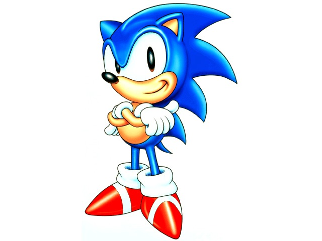
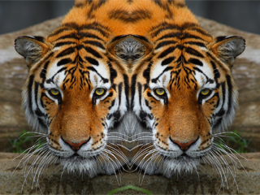

<h1>BMP Editor</h1>
BMP Editor is a program to add simple filters to BMP images. The program runs with 24 bits per pixel images with the windows `BITMAPINFOHEADER` (the most common type of BMP images) only. bmpedit has been written in C. This was originally written for an assignment of the "Introduction to Computer Systems" course at the Australian National University in early 2016.

***

To compile:  

`make`  
or  
`gcc -o nameOfOutputFile bmpedit.c`

##### To run the file after compilation you will have to follow the command line format given below
Suppose the output file of the program is called bmpedit 
On the terminal, one will have to run the program in this format 
`./bmpedit <option> <-o> <nameOfOutputImage> <nameOfInputImage>`  

**NOTE:** The arguments **must** be supplied in the mentioned order
 

where, "option" is one of the following  

Option | Function
-------|---------
`-t` (followed by a threshold value)  | threshold filter
`-i` | inverts colour
`-m` | mirror effect
`-e` | edge detection
`-h` | help
 
##### For example, these are valid command line arguments...

* `./bmpedit -t 0.5 -o hulkth.bmp hulk.bmp`
* `./bmpedit -i -o hulki.bmp hulk.bmp`
* `./bmpedit -m -o hulk.bmp hulk.bmp`
* `./bmpedit -e -o hulke.bmp hulk.bmp`
* `./bmpedit -h`

##### ...and these are not
Command line argument| Reason
---------------------|--------
`./bmpedit -t -o hulkt.bmp hulk.bmp` | Threshold value not specified
`./bmpedit -o cupth.bmp hulki.bmp -i hulk.bmp` | Order Matters! 
`./bmpedit -m hulk.bmp` | Output file name and argument not specified
`./bmpedit -e -o hulk.bmp` | Output file name not specified

 

***

### A Summary of the Program's Working

#### Part 1: Parsing the header to output dimensions

Whenever the program is run, it displays the width and height of the image, in pixels. 

##### How it works:

The Windows BMP file has a header for every image. The bytes of this header are read into an
`unsigned char` array (I got the idea from [this question on stackexchange](https://stackoverflow.com/q/13642381/6063947)).
Specific bytes store (19 to 22 for the width, and 23 to 26 for height) the information about the width and the height.
This byte information was converted to an `int` (note that `int` is four bytes long) using bitwise operators. This value is then printed to the console.

#### Part 2: Threshold Filter

Using the option `-t` with a threshold between 0 and 1 (both inclusive), changes the image colours to black or white. All those pixels which have a 
colour value (when reduced between 0 and 1) above the threshold, become white and the rest become black. Note that if a number outside the specified range is given as threshold by the user, the threshold is set to a default value 
of 0.5.

##### How it works:

Each pixel uses three bytes to store its colour information (one each for blue, green and red). For each pixel, the average of the three values is divided by 255 to obtain a
floating point number between 0 and 1. 255 is the maximum value possible for each colour. It is then compared with the threshold. If it is higher than the threshold, the BGR values
are assigned 255 each. This results in a white pixel. Otherwise, they are all set to zero. This results in a black pixel. 

### Extensions

#### Summary
Extension | Original | After effect
---|---|---
Colour Inversion |  | 
Mirror Effect| | 
Edge Detection |  | 

#### Invert Colour

This is a pretty simple extension wherein the colour of each pixel is replaced by its negative.

##### How it works:

Quite similar to the threshold filter. In this case, the contents of each of the array index 
is replaced by its negative i.e. 255 - colour value.

#### Mirror Effect

Inspired by the Mirror effect available on [Mac's Photo Booth](https://en.wikipedia.org/wiki/Photo_Booth). 
The left half of the image remains as it is. The right half of it becomes the mirror reflection of the
left half. 

##### How it works:
For each row, for upto half the row size, the bytes are duplicated into an array as they are. The index at half the row size acts as the mirror for the row. 
The bytes after the mirror, are merely the bytes equidistant to the mirror in the left side of the image. 

#### Edge Detection
This option transforms all pixels on an edge to black and the rest to white.

##### How it works:
Every pixel is compared to all the ones around it. If the colour gradient for the pixel with *any* of its surrounding pixels is above a certain threshold (which has been decided by me),
the colour of the pixel is changed to black. The threshold was set by me after several testing with multiple images. Anything higher than
or lower than the current threshold resulted in a not-so-good-looking image.

***

### Testings done

I tested all the options with seven images, with success. The images were off all sorts of dimensions - those with and without any padding.
Testing were crucial to check the threshold values in the edge detection algorithm.

Running the threshold filter with a threshold of 0.5 with the `cup.bmp` image that was provided resulted in an image which seemed identical to `cupth.bmp`. In fact, this 
[online image comparer](https://huddle.github.io/Resemble.js/) says that the two images are only 0.10% different.

***

### The good parts about my code ...

1. Readability - I have made it a point to make my code as readable as it could possibly be. 
Comments have been added to sections where the code might not be as easy to follow.

2. Portability - The code works fine independent of the endianness of the machine on which it is run. This is because the code uses 
bitwise operators to convert the byte values to integers. [Bitwise operators are known to abstract away the endianness.](https://stackoverflow.com/a/7184905/6063947)

3. Takes care of padding - Padding has been taken care of wherever necessary. Thus, the code works well for any possible image dimension.

4. Efficiency - Each of the four functions that change the array, visits each byte value only once and performs constant number of operations with it.Thus, an image with dimensions mxn has time complexity $O(m*n)$.

### ... and the not so good ones

1. Arguments must be parsed in order. Apologies. Realised this mistake quite late. 
2. The edge detector will not work if the colour difference between two edges is below the threshold value (which is not very common). 
The threshold value was not lowered because lowering the threshold value would invite more noise into the output. 

### Possible improvements for the future
1. Argument parsing can be made better
2. The edge detector can be improved to compare the diagonal pixels as well.
3. Combinations of the extensions could be made possible.

## References

##### I visited the following websites in order to come up with the piece of code

1. <https://en.wikipedia.org/wiki/BMP_file_format>
2. <http://stackoverflow.com/questions/2654480/writing-bmp-image-in-pure-c-c-without-other-libraries>
3. <https://www.youtube.com/watch?v=l7nIzo9ZCxY>
4. <http://homepages.inf.ed.ac.uk/rbf/BOOKS/PHILLIPS/cips2ed.pdf>
5. <http://www.vbforums.com/showthread.php?261522-C-C-Loading-Bitmap-Files-%28Manually%29>

